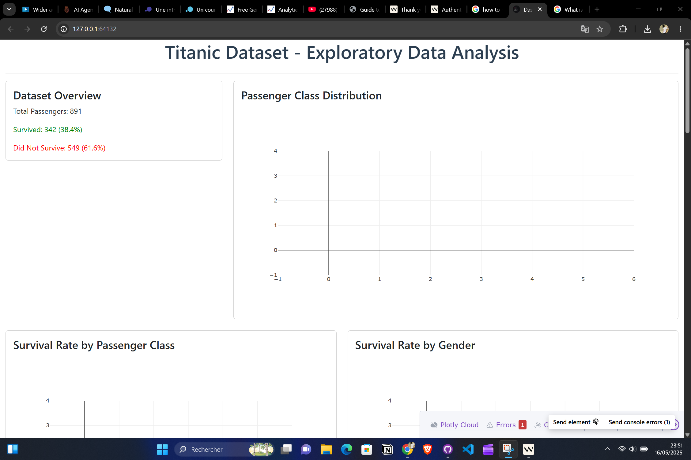
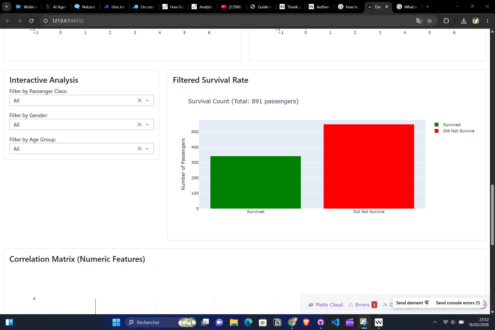
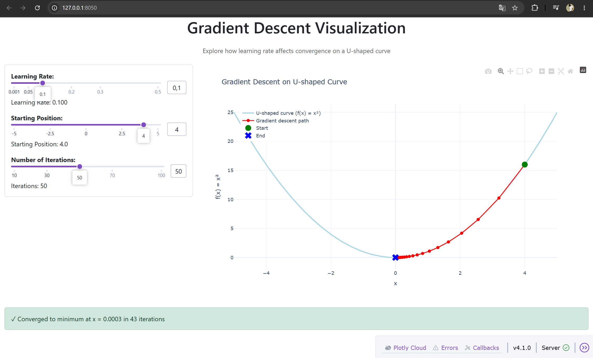

# Windsurf_Projects
In this repo I've some of my projects done with Windsurf \n

First of all, I installed windsurf, created my account and then launched it by importing extensions from VSCode 
Cascade is the name of their agent that allows you interact and create your files, projects ... 
I made my venv so that I can know which libraries were used for my projects 'python -m venv name_of_the_venv '

Pour les deux derniers projets, j'ai fait ceci, c'est comme un system prompt 

---

Pacman_turtle

---
# Prompt : " create interactive visualisation to do EDA on Titanic Dataset "

---
# Prompt : " Create an interactive visualisation to explain the effect of learning rate on gradient descent convergence in a U shaped curved. "

